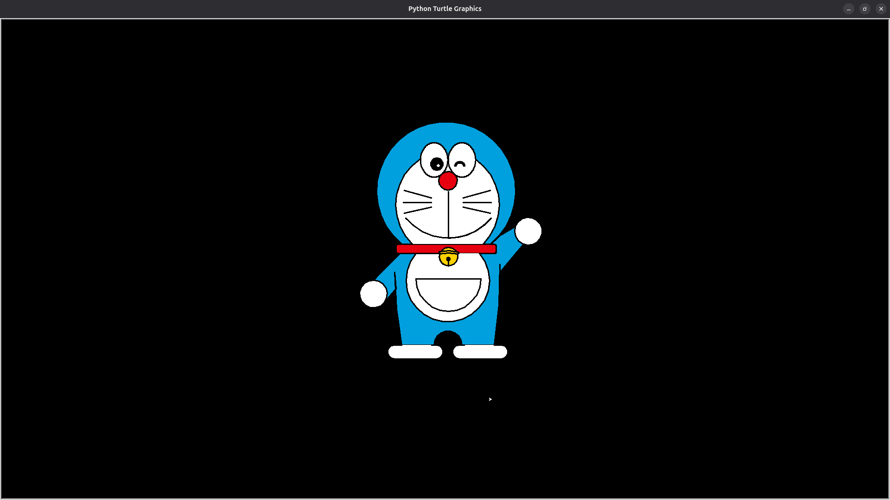

# 🐢 Doraemon Drawing with Python Turtle

This project uses Python's `turtle` graphics library to draw the beloved cartoon character **Doraemon** in a detailed and modular manner.

## 🎯 Features

- Modular structure for drawing each component of Doraemon:
  - Head
  - Face and eyes
  - Nose and mouth
  - Whiskers
  - Scarf (Muflar)
  - Hands and feet
  - Bell and body design
- Customizable colors and drawing speed
- Clean turtle movement using helper functions
- Uses Turtle's built-in `circle()`, `fd()`, `lt()`, `seth()`, and other methods for artistic control

## 🖼️ Preview



> (Place a screenshot inside the `screenshots/` folder to display above.)

## 🚀 Getting Started

### Prerequisites

Make sure Python is installed on your system. This script uses only the built-in `turtle` library.

### Installation & Run

1. Clone or download this repository.
2. Save the script as `doraemon.py`.
3. Run the script with Python:
   ```bash
   python doraemon.py
   ```

## 📁 Project Structure

```
doraemon_project/
│
├── doraemon.py             # Main turtle drawing script
├── README.md               # Project documentation
└── screenshots/
    └── doraemon_preview.png
```

## ✏️ Customization

- You can change the color scheme by editing the `fillcolor()` calls in each drawing function.
- Adjust drawing speed using `speed()` (values range from 0 [fastest] to 10 [slowest]).

## 🧠 How It Works

- Each function represents a part of Doraemon:
  - `taauko()`: Draws the head
  - `face()`: Renders eyes and facial shape
  - `nak()`, `mukh()`, `daari()`: Nose, mouth, whiskers
  - `muflar()`: Draws the scarf
  - `black_aankha()`: Details like eye pupils and shine
- The `Doraemon()` function assembles all parts into the final drawing.

## 📜 License

This project is open-source and free to use under the MIT License.

---

### 💡 Fun Tip

Try experimenting with the script by changing:
```python
bgcolor("black") → bgcolor("skyblue")
fillcolor('#00a0de') → fillcolor('#ff5733')
```
to see Doraemon in a new style!

---

Enjoy drawing with code! 🎨✨
